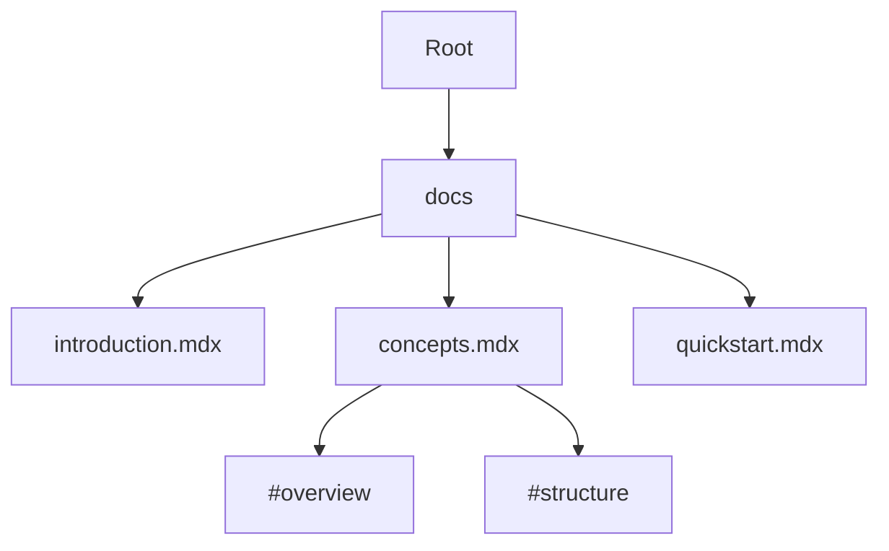

## Overview

You manage your project documentation effectively with a clear understanding of core concepts. This space organizes content hierarchically, supports version control, enables collaboration, and offers customization. Master these foundations to streamline your workflow and scale documentation as your project grows.

<Callout kind="info">
  These concepts apply to all documentation spaces in Alexander Anokhin's platform.
</Callout>

## Key Concepts Overview

Visualize the main pillars using these feature cards.

<Columns cols={2}>
  <Card title="Project Structure" icon="layers" href="#project-structure">
    Organize files and folders logically for easy navigation.
  </Card>

  <Card title="Version Control" icon="git-branch" href="#version-control">
    Track changes with Git integration.
  </Card>

  <Card title="Collaboration" icon="users" href="#collaboration">
    Work with teams using pull requests and reviews.
  </Card>

  <Card title="Customization" icon="settings" href="#customization">
    Tailor themes, layouts, and components.
  </Card>
</Columns>

## Project Structure and Hierarchy

Your documentation follows a nested folder structure starting from the root directory. Place MDX files in a `docs/` folder for automatic indexing. Use frontmatter for metadata and H2 headings for sections.



This hierarchy ensures searchable, navigable content. Link between pages with relative paths like `/quickstart`.

## Version Control Basics

Integrate Git to track changes. Follow these steps to initialize a repository.

<Steps>
  <Step title="Initialize Repository" icon="git-branch">
    Create a new Git repo in your project root.
    
````bash
git init
git add .
git commit -m "Initial documentation commit"
````
  </Step>

  <Step title="Connect Remote" icon="cloud-upload">
    Push to your hosting service.
    
````bash
git remote add origin https://github.com/yourusername/alexander-anokhin-docs.git
git branch -M main
git push -u origin main
````
  </Step>

  <Step title="Branch for Changes" icon="git-pull-request">
    Work on features in branches.
    
````bash
git checkout -b feature/new-concept
# Make changes
git add docs/concepts.mdx
git commit -m "Add core concepts"
git push origin feature/new-concept
````
  </Step>
</Steps>

<CodeGroup tabs="Bash,PowerShell">
```bash
git status
git log --oneline
```

```powershell
git status
git log --oneline
```
</CodeGroup>

## Collaboration Workflows

Choose workflows based on team size.

<Tabs>
  <Tab title="Solo Developer" icon="user">
    Commit directly to `main` for personal projects.
    
    <Callout kind="tip">
      Use descriptive commit messages like `docs(guide): add authentication flow`.
    </Callout>
  </Tab>

  <Tab title="Team Collaboration" icon="users">
    Create pull requests for reviews.
    
    1. Fork the repo.
    2. Branch and commit changes.
    3. Open PR with clear description.
    
    Reviewers approve after checks pass.
  </Tab>

  <Tab title="Advanced: GitHub Actions" icon="github">
    Automate builds and previews.
    
````yaml
# .github/workflows/docs.yml
name: Deploy Docs
on: [push]
jobs:
  build:
    runs-on: ubuntu-latest
    steps:
      - uses: actions/checkout@v4
      - run: npm ci
      - run: npm run build
````
  </Tab>
</Tabs>

## Customization Options

Tailor your space with MDX components and themes.

<ExpandableGroup>
  <Expandable title="Theme Configuration" default-open="true">
    Edit `theme.config.jsx` to set brand color.
    
````jsx
// theme.config.jsx
export default {
  color: '#3B82F6', // Brand blue
  logo: '/logo.svg',
};
````
  </Expandable>

  <Expandable title="Custom Components">
    Extend with your own JSX in `components/`.
    
    Example: Add a custom `<CustomCallout />`.
  </Expandable>

  <Expandable title="Advanced: Plugins">
    Integrate search, analytics, or i18n via Next.js plugins.
  </Expandable>
</ExpandableGroup>

<Columns cols={3}>
  <Card title="Quickstart" icon="rocket" href="/quickstart">
    Get started now.
  </Card>

  <Card title="Authentication" icon="lock" href="/authentication">
    Secure your space.
  </Card>

  <Card title="Changelog" icon="git-commit" href="/changelog">
    Track updates.
  </Card>
</Columns>